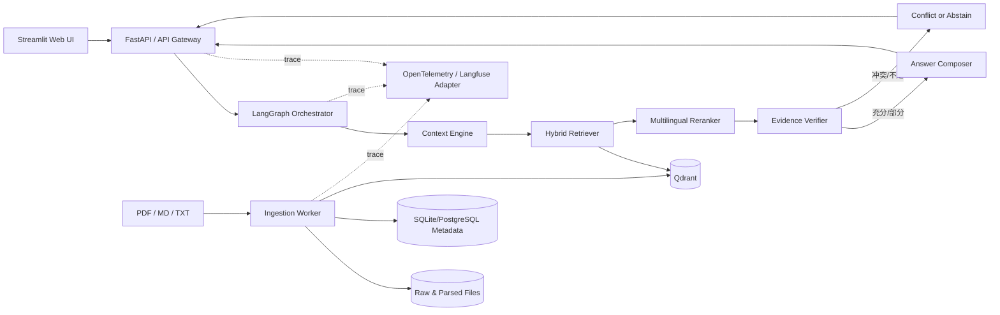

# 中葡经贸合规智能体：需求与架构优化提案

> 状态：待确认，不进入开发  
> 目标岗位：中葡经贸中心 AI 开发工程师  
> 原始需求：`demo需求说明_给AI编程工具.md`

## 1. 结论摘要

原方案选题准确，抓住了“跨语言”和“可信合规”两个真实业务痛点，也具备快速做出 Demo 的条件。但它当前主要证明的是基础 RAG 链路能力，尚未充分体现岗位最看重的四项能力：

1. Context Engine 的工程设计；
2. 有边界、可观测、可恢复的多 Agent 协作；
3. 可量化的模型/检索优化与评测闭环；
4. 面向高并发和持续迭代的系统架构。

建议将项目从“葡西语国家出海合规问答 Demo”升级为：

**中葡经贸合规智能体（Sino-Lusophone Trade Compliance Copilot）**

第一阶段只做巴西、葡萄牙两个法域和三个主题，以较小范围把上下文管理、证据链、拒答和评测做深；第二阶段再展示西语、多 Agent 任务流、模型微调和生产化扩展能力。

项目的核心卖点调整为：

> 不是让模型“知道更多”，而是构建一个能够识别法域、时间、企业背景和用户意图，按证据作答，并让每个结论都可审计的 Context Engine。

## 2. 原始需求评估

### 2.1 值得保留的部分

- 场景与机构业务高度相关，而非通用聊天机器人；
- 中文问题检索葡语材料，能直观展示跨语言能力；
- 引用、置信度和拒答适合政企合规场景；
- FastAPI、Python、可切换模型、本地向量存储适合快速交付；
- 初步提出了评测集和回归测试意识。

### 2.2 需要修正的关键问题

#### 问题一：业务边界过宽

“葡语/西语 29 国 + 投资/税务/用工”会迅速产生法域、时效和数据质量问题。少量公开 PDF 无法支撑如此宽的产品承诺，也容易在演示中触发错误答案。

**调整：** MVP 仅覆盖巴西、葡萄牙；主题仅覆盖外资准入、税务概览、劳动用工。西语和其他国家作为扩展架构，不作为首版验收承诺。

#### 问题二：Context Engine 缺席

原方案只描述“问题 → 检索 → 生成”，没有定义对话历史、用户画像、法域、时间有效性、任务意图、权限和 token 预算如何共同构成模型上下文。

**调整：** 把 Context Engine 设为系统核心模块，显式产出结构化 `ContextPackage`，再交给检索和回答节点使用。

#### 问题三：置信度定义不可信

不能把向量相似度直接转换成“答案置信度”。不同索引、语言、查询长度和模型下的分数不可直接比较；一个很高的相似度也不代表证据支持最终结论。

**调整：** 对用户展示“证据充分度：充分 / 有限 / 不足”，内部由检索质量、证据覆盖、来源权威性、时效性、冲突和结论可归因性共同决策。阈值必须通过验证集校准。

#### 问题四：引用粒度不足

“文件名 + 片段”不能满足真正的审计。PDF 更新、同名文件、跨页切块都会使引用难以复核。

**调整：** 每条引用至少包含：文档标题、发布机构、来源 URL、发布日期/生效日期、版本或内容哈希、页码/章节、原文片段、入库时间。回答中的关键结论使用句级引用编号。

#### 问题五：指标定义不完整

“Top-3 命中率 ≥85%”没有定义相关性标注和命中口径；“端到端响应 <3 秒”也未区分首 token、完整回答、冷启动、硬件和模型 API。

**调整：** 分别评估检索、回答、引用、拒答、性能与成本，并明确数据集、统计口径和运行环境。

#### 问题六：技术栈与目标不完全匹配

FAISS 很适合最小原型，但元数据过滤、文档更新、删除、混合检索、并发访问和持久化运维需要大量自建逻辑，不利于展示工程能力。

**调整：** MVP 默认采用本地 Qdrant（支持过滤和混合检索）；通过 `VectorStore` 接口保留 FAISS 轻量模式和生产环境替换能力。

#### 问题七：没有覆盖不可信文档和提示注入

外部文档内容可能包含错误指令、过期规定或与其他来源冲突。系统不能把检索到的文本当作系统指令执行。

**调整：** 文档内容永远按“不可信数据”处理；工具调用由白名单与结构化参数约束；冲突、过期和来源等级进入回答决策。

## 3. 优化后的产品需求

### 3.1 目标用户

- 准备进入巴西或葡萄牙市场的中国企业业务人员；
- 为企业提供咨询服务的中葡经贸中心工作人员；
- 需要快速定位官方材料、但不以系统回答替代专业法律意见的研究人员。

### 3.2 MVP 核心场景

1. **事实问答：** “中国企业在巴西设立有限责任公司通常涉及哪些登记环节？”
2. **跨语言检索：** 用户用中文提问，答案引用葡语原文并给出中文解释；葡语提问亦可检索中文或葡语资料。
3. **对比问答：** “巴西和葡萄牙在标准工时方面有什么差异？”系统分别检索两个法域并按来源对照，不能混用法域。
4. **追问理解：** 用户先问巴西设立公司，再问“税务方面呢？”，系统从会话状态继承“巴西 + 企业设立”上下文。
5. **证据不足与冲突：** 当资料缺失、过期或互相矛盾时，系统说明缺口、展示现有来源并拒绝给出确定结论。
6. **报告导出：** 将当前问答导出为带问题、答案、证据和免责声明的 Markdown 报告；PDF 导出放入第二阶段。

### 3.3 MVP 范围

| 维度 | 首版范围 | 暂不承诺 |
|---|---|---|
| 国家/法域 | 巴西、葡萄牙 | 全部葡语/西语国家 |
| 语言 | 中文、葡萄牙语 | 西班牙语仅做扩展测试 |
| 主题 | 外资准入、税务概览、劳动用工 | 个案法律意见、自动报税、交易执行 |
| 数据 | 经过登记的公开官方/权威资料 | 任意互联网搜索结果直接入库 |
| 输出 | 摘要、分点结论、句级引用、证据充分度 | 代替律师/会计师作最终判断 |
| 交互 | 单轮与有限多轮问答、对比问答 | 无边界自主行动 |

### 3.4 功能需求

#### FR-01 文档接入与治理

- 支持 PDF、Markdown、TXT；扫描 PDF 可选 OCR；
- 文档入库前登记法域、语言、主题、发布机构、来源 URL、发布日期、生效日期、失效日期和来源等级；
- 文档按内容哈希去重，同一来源的新版本应建立版本关系；
- 支持增量新增、更新、软删除和重建索引；
- 对解析失败、缺少关键元数据或疑似重复的文档给出可操作错误报告；
- 原始文件、解析文本、chunk 和索引记录使用稳定 ID 串联。

#### FR-02 结构感知切分

- 优先按标题、章节、条款、表格和页码切分，而不是仅按固定字符数；
- chunk 保留父章节及相邻上下文引用；
- 针对法规条款、表格和普通叙述允许不同切分策略；
- 所有 chunk 保留页码/章节、语言、法域、时间和来源等级元数据。

#### FR-03 Context Engine

每次请求生成一个结构化 `ContextPackage`：

```text
request_id
user_query_original
query_language
normalized_query
intent                 # fact / compare / summarize / follow_up
jurisdictions[]
topics[]
time_scope
enterprise_profile     # 可选：行业、规模、投资方式
conversation_summary
retrieval_queries[]    # 原语言 + 必要的跨语言查询
metadata_filters
evidence_budget
answer_language
risk_flags[]
```

规则：

- 法域、时间或指代不明确且会改变答案时，优先澄清；
- 不需要翻译即可跨语言命中时，不强制翻译查询；
- 对比问题拆成多个受法域约束的检索子任务；
- 对话记忆只保留结构化事实与短摘要，不把全部历史无限塞入 prompt；
- 对企业敏感信息进行最小化记录与日志脱敏。

#### FR-04 混合检索与重排

- 第一阶段召回：多语言 dense + lexical/sparse，两路各取候选；
- 使用 RRF 或可配置融合策略合并候选；
- 对候选进行多语言 reranker 重排；
- 支持法域、主题、语言、有效日期、来源等级过滤；
- 采用 parent-child retrieval：小块用于命中，父章节用于生成上下文；
- 返回检索解释信息：命中的查询、过滤条件、原始排名、融合排名和重排分数。

#### FR-05 证据核验与冲突处理

- 将问题拆成需要证据支持的关键主张；
- 检查证据是否覆盖各主张，而非只检查文档是否“相似”；
- 检查同一结论是否存在来源冲突、法域错配或时效问题；
- 优先级默认：现行官方法规/政府页面 > 官方指南 > 国际组织/权威机构 > 一般介绍；
- 若来源冲突，不擅自裁决，展示差异、日期和来源并提示人工确认。

#### FR-06 回答生成与引用

- 回答必须只基于 `EvidenceBundle` 中的材料；
- 每个关键事实后附引用编号；
- 同时显示原文摘录和回答语言下的解释，译文需标记为“机器辅助翻译”；
- 引用可定位到文件、页码/章节和来源 URL；
- 明确说明信息截至日期和非法律意见声明；
- 输出采用结构化 schema，后端校验后再返回前端。

#### FR-07 分级拒答

回答状态统一为：

- `ANSWERED`：证据充分，可给出有边界的回答；
- `PARTIAL`：只能回答部分问题，逐项说明已支持和未支持内容；
- `CONFLICTED`：来源冲突或时效无法判断，展示冲突但不给确定结论；
- `ABSTAINED`：无足够可靠证据，明确拒答并建议下一步。

拒答决策不能只依赖一个相似度阈值，应综合：候选数量、reranker 分数、主张覆盖率、来源等级、时效、法域一致性、冲突标记和引用可归因性。

#### FR-08 可观测与审计

- 为每次请求记录 trace_id，并追踪各节点耗时、模型、token、费用、召回结果和状态转移；
- 默认不在日志保存完整敏感问题和文档正文；调试内容显式开关；
- 保存 prompt 模板版本、索引版本、模型版本和配置版本，使评测可复现；
- 提供调试视图展示 ContextPackage、检索路径和证据决策，普通用户界面隐藏内部推理文本。

#### FR-09 反馈闭环

- 用户可标记“有帮助/无帮助”、引用错误、答案过期和应答/拒答错误；
- 反馈关联 request_id、索引版本和模型配置；
- 经人工审核的失败案例进入回归集，不直接自动训练模型。

### 3.5 非功能需求

- **性能：** 热启动条件下，检索 p95 < 1.0 秒；首 token p95 < 3 秒；完整回答 p95 < 10 秒。记录冷启动性能但不与热启动混合统计。
- **并发：** MVP 以 20 个并发请求做压力测试；API 无状态，会话和任务状态外置，模型调用设超时、限流和重试。
- **可靠性：** 单个解析任务失败不能中断整批入库；外部模型超时返回可解释错误；索引更新使用版本切换，避免半成品可见。
- **安全：** API 密钥仅来自环境变量；上传文件校验类型、大小和路径；检索文本不得覆盖系统指令；日志脱敏。
- **可移植：** 模型、embedding、reranker、vector store 均通过接口/适配器切换；核心业务层不依赖某个云厂商 SDK。
- **可复现：** 锁定依赖版本，提供 `.env.example`、Docker Compose、初始化数据清单和一键评测命令。

## 4. 推荐架构

### 4.1 总体结构



### 4.2 查询状态图

```text
START
  → input_guard
  → context_builder
  → ambiguity_check ──需要澄清──→ clarify → END
  → query_planner
  → parallel_retrieval
  → fusion_and_rerank
  → evidence_verifier
      ├─ sufficient → answer_composer → citation_validator → END
      ├─ partial    → partial_answer  → citation_validator → END
      ├─ conflict   → conflict_report                    → END
      └─ insufficient → abstain                          → END
```

LangGraph 用于显式状态、分支、并行检索和失败恢复。检索、引用校验、法域过滤等确定性步骤保持普通函数/服务，不为了“多 Agent”而全部包装成自由自治 Agent。

### 4.3 Agent/节点职责

| 角色 | 输入 | 输出 | 边界 |
|---|---|---|---|
| Context Builder | 问题、会话摘要、可选企业画像 | ContextPackage | 不回答业务问题 |
| Query Planner | ContextPackage | 受法域约束的检索计划 | 不接触任意外部工具 |
| Retrieval Worker | 单个检索子任务 | CandidateEvidence[] | 只读知识库 |
| Evidence Verifier | 候选证据、问题主张 | EvidenceBundle + decision | 不补写缺失事实 |
| Answer Composer | 已核验证据 | 结构化答案 | 不引用 EvidenceBundle 外内容 |
| Citation Validator | 答案、证据 | 通过/退回及原因 | 校验引用存在、定位有效、主张可归因 |

这套设计能在面试中体现多 Agent 协作，但关键决策仍可测试、可追踪，不依赖不可控的 Agent 自由对话。

### 4.4 数据模型

核心实体：

- `Document`：来源、机构、法域、语言、主题、发布日期、生效/失效日期、权威等级、哈希；
- `DocumentVersion`：版本关系、解析状态、索引状态；
- `Chunk`：正文、页码、章节、父级 ID、语言、token 数；
- `QueryTrace`：上下文、检索配置、索引版本、模型版本、耗时与成本；
- `Evidence`：chunk、命中原因、排名、分数、引用定位；
- `Answer`：状态、结构化内容、引用、证据充分度、免责声明；
- `Feedback`：类型、人工备注、是否进入评测集。

### 4.5 技术选型

| 层 | MVP 推荐 | 选择理由 | 扩展方向 |
|---|---|---|---|
| 编排 | LangGraph | 状态、条件分支、并行任务和可观测路径清晰 | 独立工作流服务 |
| API | FastAPI | 类型校验、异步、OpenAPI、易测试 | 多实例 + 网关 |
| UI | Streamlit | 快速演示，适合调试面板 | React/Next.js 产品化 |
| 元数据 | SQLite | Demo 零依赖 | PostgreSQL |
| 向量检索 | Qdrant 本地 | 过滤、持久化、dense+sparse、更新能力 | Qdrant 集群/Milvus |
| Embedding | BGE-M3 | 中葡跨语言，且可同时产出 dense/sparse 表示 | 服务化部署或供应商 API |
| Reranker | BGE reranker 多语言版本 | 提升跨语言候选排序 | 蒸馏/领域微调 |
| LLM | OpenAI-compatible adapter | 可切 DeepSeek、通义、OpenAI 或本地 vLLM | 路由、降级、缓存 |
| 解析 | PyMuPDF/pypdf + 可选 OCR | 页码定位和本地可控 | Docling/LlamaParse adapter |
| 观测 | OpenTelemetry 抽象 + Langfuse 可选 | 避免锁定，统一 traces/metrics/logs | 集中式监控告警 |

说明：FAISS 保留为 `VectorStore` 的轻量实现，但不作为主演示路径。BGE-M3 原生支持 dense、sparse 和 multi-vector，可先落地 dense+sparse，避免首版把 ColBERT 式多向量检索也纳入复杂度。

## 5. 评测与验收标准

### 5.1 评测集设计

首版至少 60 条，经人工标注：

- 20 条中文单法域事实问题；
- 10 条葡语单法域问题；
- 10 条跨语言命中问题；
- 8 条双法域对比问题；
- 6 条多轮指代/上下文问题；
- 6 条必须拒答或存在冲突的问题。

每条记录：标准意图、法域、主题、相关文档/chunk、必须覆盖的关键点、期望状态和不应出现的结论。评测集与演示样例分离，避免只对样例调参。

### 5.2 验收指标

| 层级 | 指标 | MVP 目标 |
|---|---|---|
| 意图/上下文 | 法域识别准确率 | ≥ 95% |
| 检索 | Recall@5 | ≥ 90% |
| 检索 | MRR@10 | ≥ 0.80 |
| 回答 | 关键点覆盖率 | ≥ 85% |
| 引用 | Citation precision | ≥ 95% |
| 引用 | Citation coverage | ≥ 90% |
| 忠实性 | 无证据主张率 | ≤ 5% |
| 拒答 | 拒答 precision / recall | 均 ≥ 85% |
| 性能 | 检索 p95 | < 1.0 秒 |
| 性能 | 首 token p95 | < 3 秒 |
| 性能 | 完整回答 p95 | < 10 秒 |
| 工程 | 关键模块单元测试覆盖 | ≥ 80% |

指标必须由脚本生成 JSON/Markdown 报告，不手填“命中率”。同时保存失败案例，给出按语言、国家、主题和问题类型的切片结果。

### 5.3 必测失败场景

- 问题未指定法域且不同国家答案不同；
- 文档过期或缺少生效日期；
- 两份权威资料互相冲突；
- 中文问题包含葡语专有名词；
- PDF 表格跨页或 OCR 质量差；
- 用户要求忽略规则、隐藏来源或编造确定答案；
- 文档正文含“覆盖系统提示”等提示注入文本；
- 模型超时、embedding 服务不可用、索引正在切换；
- 对话中途从巴西切换到葡萄牙，后续指代不能串法域。

## 6. 与岗位要求的映射

| 岗位要求 | 项目证据 |
|---|---|
| Context Engine | 结构化 ContextPackage、会话摘要、法域/时间/企业画像、token 与证据预算 |
| 多 Agent | LangGraph 状态图、职责边界、并行检索、核验与退回路径 |
| 微调与训练 | 双语评测集、hard negative 挖掘、reranker/embedding 可选微调、前后对照实验 |
| 工程架构 | API/索引解耦、异步任务、版本化、可替换适配器、并发与降级 |
| 产品与判断力 | 缩小法域、分级拒答、冲突披露、信息时效和非法律意见边界 |
| 持续迭代 | trace + 用户反馈 + 失败案例进入回归集 |

## 7. 微调策略

首版不应为了满足岗位描述而盲目微调生成模型。顺序应为：

1. 建立可靠评测集和基线；
2. 优化元数据、切分、混合检索和 reranker；
3. 从真实失败案例中构造中葡 query-positive-hard-negative 三元组；
4. 数据量与收益足够时，优先微调 reranker 或 embedding；
5. 仅当意图识别、结构化输出或表达风格存在稳定缺陷时，再评估 LLM 的 LoRA/SFT。

第二阶段可交付一份小规模训练实验：数据清洗规则、训练/验证集隔离、训练配置、基线与微调后 Recall/MRR 对比、过拟合及跨语言退化分析。即使提升不大，也要如实报告。

## 8. 建议的代码结构（确认后实施）

```text
.
├─ apps/
│  ├─ api/                 # FastAPI 路由、schema、依赖注入
│  └─ web/                 # Streamlit 演示界面
├─ src/
│  ├─ context_engine/      # 上下文抽取、会话摘要、检索计划
│  ├─ workflows/           # LangGraph 状态与节点
│  ├─ ingestion/           # 解析、清洗、切分、版本化
│  ├─ retrieval/           # dense/sparse、融合、rerank
│  ├─ evidence/            # 覆盖、冲突、时效、引用校验
│  ├─ generation/          # 提示模板与结构化回答
│  ├─ providers/           # LLM/embedding/vector store 适配器
│  ├─ observability/       # trace、metrics、日志脱敏
│  └─ domain/              # 核心实体、枚举、协议
├─ data/
│  ├─ raw/
│  ├─ manifests/
│  └─ sample/
├─ evals/
│  ├─ datasets/
│  ├─ evaluators/
│  └─ reports/
├─ tests/
│  ├─ unit/
│  ├─ integration/
│  └─ security/
├─ scripts/
├─ docker-compose.yml
├─ pyproject.toml
├─ .env.example
└─ README.md
```

不再使用只有 `ingest.py / rag.py / app.py` 的平铺结构，因为它会很快把领域逻辑、供应商调用和 Web 代码耦合在一起。

## 9. 分阶段交付

### Phase 0：数据与验收基线

- 确定巴西/葡萄牙各 2–4 份权威文档；
- 建立 manifest、数据许可/来源说明和首批 60 条评测集；
- 固化成功指标与演示脚本。

### Phase 1：可面试演示的 MVP

- 文档增量入库、版本和元数据治理；
- Context Engine；
- dense+sparse 混合检索与 rerank；
- 状态图式问答、分级拒答、句级引用；
- 中文/葡语 UI、调试 trace；
- 自动评测、测试、Docker Compose、一键启动。

### Phase 2：强化岗位匹配度

- 多 Agent 对比/报告工作流；
- hard-negative 数据闭环与 reranker/embedding 微调实验；
- PostgreSQL、异步任务队列、多实例压测；
- OCR、更多国家/西语、权限隔离；
- 录屏、架构讲解和面试问答材料。

## 10. 暂不实施的内容

以下内容在确认前不进入代码：

- 下载或提交任何真实业务资料；
- 选择或购买外部模型 API；
- 训练/微调模型；
- 部署云服务；
- 扩展到全部葡语/西语国家；
- 让 Agent 执行报税、提交申请或其他外部操作。

## 11. 待确认的架构决策

建议按以下默认值进入开发：

1. 产品范围：巴西 + 葡萄牙，外资准入/税务概览/劳动用工；
2. 主检索库：本地 Qdrant，保留 FAISS adapter；
3. 编排：LangGraph 状态图；
4. Embedding：BGE-M3 dense+sparse，配多语言 reranker；
5. UI：Streamlit，API 与 UI 分离；
6. LLM：OpenAI-compatible adapter，开发时可用 mock 模式完成无密钥测试；
7. 评测集：首版 60 条，自动生成报告；
8. 交付策略：先完成 Phase 0 + Phase 1，Phase 2 单独确认。

确认这些默认决策后，再进入技术设计细化和实现。
