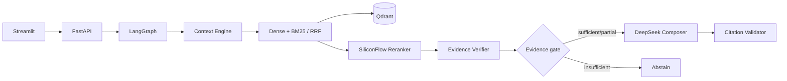

# 中葡经贸合规智能体

面向中国企业出海巴西、葡萄牙场景的可审计跨语言 RAG Demo。系统把 Context Engine 作为核心：先识别语言、法域、主题、意图和会话指代，再执行混合检索、重排、证据门控和带句级引用的回答生成。没有可靠依据时会澄清、部分回答或拒答。

> 本项目提供资料检索辅助，不构成法律、税务或投资意见。

## 当前模型配置

- Embedding：硅基流动 `Qwen/Qwen3-Embedding-8B`
- Reranker：在线默认使用硅基流动 `Qwen/Qwen3-Reranker-4B`；质量档可切换为 8B
- LLM：DeepSeek `deepseek-v4-flash`
- 所有模型名和 API 地址均可通过环境变量切换。

不要把真实 API Key 写入仓库。任何曾在聊天、截图或日志中出现的 Key 都应撤销并重新生成。

## 架构



详细需求和决策见 [RAG系统需求与架构优化提案.md](RAG系统需求与架构优化提案.md)。

## 本地启动

要求 Python 3.11–3.13。

### Linux（Ubuntu / Debian / WSL）

先安装 Python、虚拟环境和构建依赖；Docker 方案无需在主机安装 Python。

```bash
sudo apt update
sudo apt install -y python3 python3-venv python3-pip build-essential
python3 -m venv .venv
./.venv/bin/python -m pip install --upgrade pip
./.venv/bin/python -m pip install -e ".[dev]"
cp .env.example .env
```

在 `.env` 中填入 `SILICONFLOW_API_KEY` 和 `DEEPSEEK_API_KEY` 后，执行：

```bash
./.venv/bin/python -m scripts.ingest
./.venv/bin/python -m uvicorn apps.api.main:app --host 0.0.0.0 --port 8000
# 新开一个终端
./.venv/bin/python -m streamlit run apps/web/app.py --server.address 0.0.0.0 --server.port 8501
```

Linux 服务器默认只监听本机时，将 API 命令中的 `--host 0.0.0.0` 改为 `127.0.0.1`；如需对外暴露，请通过反向代理、TLS 与访问控制保护服务，不要直接暴露开发服务端口。

### Windows PowerShell

```powershell
python -m venv .venv
.\.venv\Scripts\python.exe -m pip install -e ".[dev]"
Copy-Item .env.example .env
```

在 `.env` 中填入重新生成的 `SILICONFLOW_API_KEY` 和 `DEEPSEEK_API_KEY`，随后：

```powershell
.\.venv\Scripts\python.exe -m scripts.ingest
.\.venv\Scripts\python.exe -m uvicorn apps.api.main:app --reload
.\.venv\Scripts\python.exe -m streamlit run apps/web/app.py
```

API 文档位于 `http://127.0.0.1:8000/docs`，Web 界面位于 `http://localhost:8501`。

### Docker（Linux / Windows Docker Desktop）

Docker Compose 会将本机 `data/` 挂载到容器中，索引与 SQLite 数据库因此可持久化。首次运行前准备 `.env`，并先建立索引：

```bash
cp .env.example .env
# 编辑 .env，填入两个 API Key
docker compose build
docker compose run --rm api python -m scripts.ingest
docker compose up -d
docker compose logs -f api web
```

访问 `http://127.0.0.1:8000/docs` 和 `http://127.0.0.1:8501`。停止服务：

```bash
docker compose down
```

`data/raw/` 不随 Git 仓库分发。请从 manifest 中的官方来源下载资料至该目录后再执行入库；容器中也沿用这一规则。

## 数据治理

`data/raw` 保存原始公开资料，`data/manifests/*.json` 保存来源、发布机构、法域、语言、主题、发布日期和来源等级。当前初始资料来自商务部国家层面海外综合服务平台：

- 《对外投资合作国别（地区）指南——巴西》
- 《对外投资合作国别（地区）指南——葡萄牙》

商务部声明这些指南供企业和读者免费下载使用，同时禁止营利性销售。仓库公开发布前应再次核对数据文件的再分发边界；如不提交 PDF，可保留 manifest 和下载说明。

新增文档时：

1. 将 PDF/Markdown/TXT 放入 `data/raw`；
2. 在 `data/manifests` 新增 manifest；
3. 运行 `python -m scripts.ingest`。内容哈希未变化时会跳过；同一 `document_id` 的新版本会替换旧索引。

## API 示例

```json
POST /v1/query
{
  "query": "葡萄牙企业所得税的一般规则是什么？",
  "answer_language": "zh",
  "jurisdictions": ["PT"],
  "conversation": []
}
```

回答状态：`ANSWERED`、`PARTIAL`、`CONFLICTED`、`ABSTAINED`。界面展示的是证据充分度，不把向量相似度包装为答案置信概率。

## 评测

```bash
# Linux / macOS
./.venv/bin/python -m scripts.evaluate --dataset evals/datasets/smoke.json
./.venv/bin/python -m pytest

# Windows PowerShell
.\.venv\Scripts\python.exe -m scripts.evaluate --dataset evals/datasets/smoke.json
.\.venv\Scripts\python.exe -m pytest
```

评测报告自动写入 `evals/reports`。检索评测不调用 DeepSeek；端到端评测加 `--end-to-end`。

## 安全边界

- 文档内容始终是不可信数据，不能覆盖系统提示；
- 上传路径必须位于 `RAW_DATA_DIR`；
- API 错误不回显供应商 payload 或凭证；
- 引用校验失败时关闭式拒答；
- 调试 trace 默认关闭，避免问题和证据正文进入日志。
